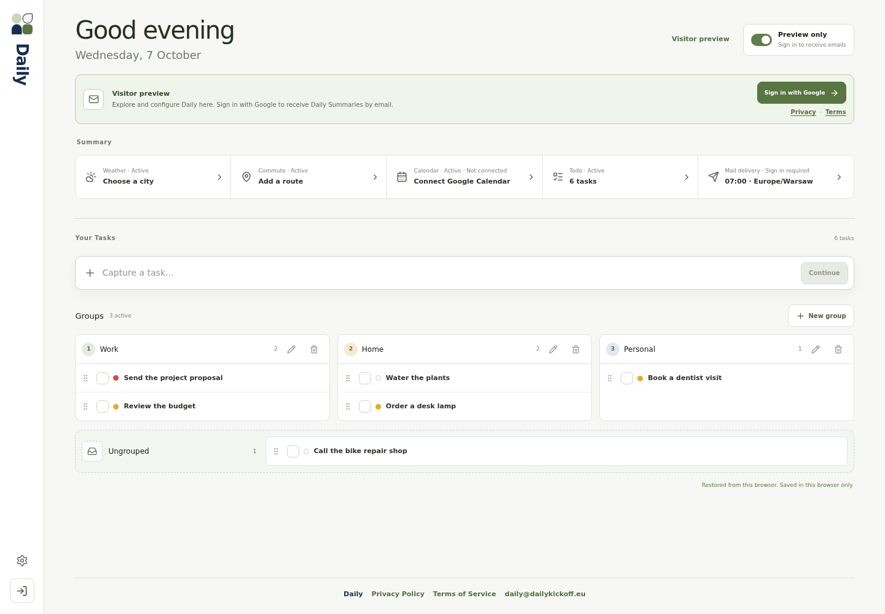
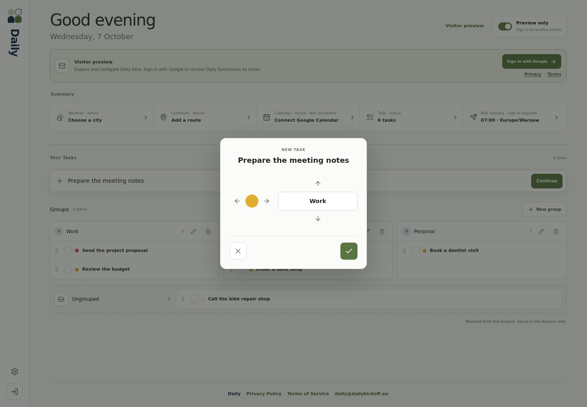
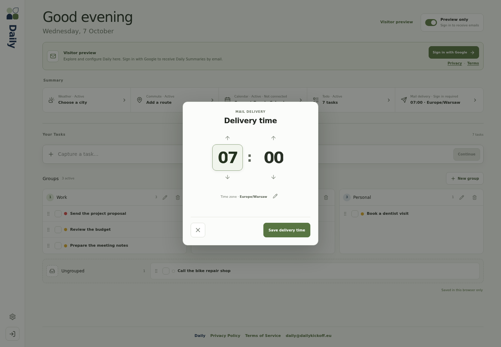
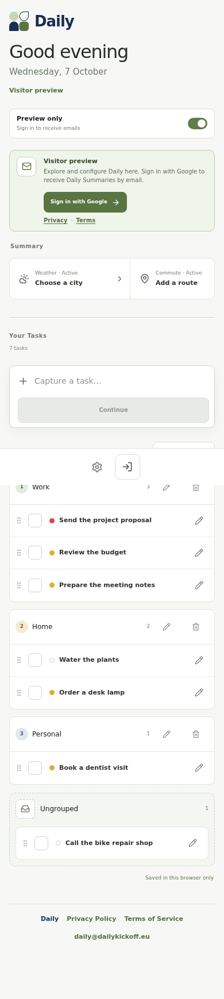

# Daily

Daily helps you plan your day. It combines tasks, weather, driving times, and Google Calendar events in one Daily Summary email.

You can use the task list and change settings without an account. Daily saves this Local Setup in your browser.
To receive emails, sign in with Google. Google Calendar access is a separate, optional connection.



[Watch the 24-second demo](docs/media/daily-demo.mp4) · [Edit the Remotion video](docs/video/README.md)

## What Daily does

| Summary Section | Content |
| --- | --- |
| Weather | Your chosen city's temperature, forecast, rain probability, and wind. |
| Commute | Driving time for each enabled route scheduled for today, with current traffic. |
| Calendar | Events from selected Google calendars for today and the next six days. |
| Todo | Your unfinished tasks, in your chosen order and groups. |

Daily sends the email at your Summary Time, in your User Time Zone. The default Summary Time is 07:00.
You can pause email delivery or pause individual sections.
Each email keeps all four section headings. A paused, empty, unconfigured, or unavailable section shows its status.
An unavailable section does not stop the other sections or the email.

## Use Daily

### Start without an account

1. Open Daily in your browser.
2. Select **Show me** for the introduction, or **Skip** to open the task list.
3. Add tasks and change the settings that you need.

Visitor mode does not send emails. Your Local Setup stays in this browser and does not synchronize between devices.
If you clear browser storage, you remove your Local Setup.
On your first Google sign-in, Daily imports Local Setup only if you have no saved setup.
It does not replace an existing saved setup.

### Add and manage tasks

1. Enter a title in **Capture a task…**.
2. Select **Continue**.
3. Use the arrows to select a group and urgency: low, medium, or high.
4. Select the check mark to add the task.

Select **New group** to create a Todo Category. You can rename groups and edit, reorder, complete, or delete tasks.
Urgency does not change task order. Tasks have no due dates.
Daily removes completed tasks and does not keep a completed task history.
If you delete a group, Daily also deletes its tasks.



### Set the other sections

| Control | Action |
| --- | --- |
| **Weather** | Search for a city. Select a result to set the Weather Location. |
| **Commute** | Select **Add route**. Enter a name, origin, and destination. Select the route days, then save. |
| **Calendar** | Sign in with Google. Connect Google Calendar, then select the calendars to include. |
| **Mail delivery** | Set the hour, minute, and time zone. Select **Save delivery time**. |

You can save up to five driving routes. Each route has its own days and starts with Monday through Friday selected.
Visitor calendar examples are sample events, not your Google Calendar events.



### Receive emails

1. Select **Sign in with Google**.
2. If you are new to Daily, select **Create account** and accept the Terms.
3. Complete Google sign-in.
4. Set **Mail delivery** to your preferred time and time zone.
5. Make sure Summary Delivery is enabled.

Daily sends emails to the verified email address from your Google account.
Open **Settings** to send a Test Daily Summary or inspect Delivery history.
Delivery history contains delivery attempts from the last 30 days, not copies of emails.

Use the delivery switch to pause emails. Use a section's pause control to pause only that section.
Pausing all sections does not pause email delivery.
To repeat the introduction, open **Settings → Show me around**.



## Install and run locally

Use Git, Node.js **22.23.2**, and npm **10.9.8**. These versions are specified in `.nvmrc` and `package.json`.
The commands below use a POSIX shell. See [Supported runtime](docs/supported-runtime.md) for details.

1. Get the source:

   ```sh
   git clone https://github.com/poppyseedcake/daily.git
   cd daily
   ```

2. If you use nvm, select the specified Node.js version:

   ```sh
   nvm install
   nvm use
   npm install --global npm@10.9.8
   ```

3. Install the dependencies:

   ```sh
   npm ci
   ```

4. Create your local configuration:

   ```sh
   cp .env.example .env
   node -e "console.log(require('node:crypto').randomBytes(32).toString('hex'))"
   ```

   Open `.env`. Set `BETTER_AUTH_SECRET` to the generated value.
   For local use without a PostHog account, set these values:

   ```dotenv
   PUBLIC_POSTHOG_PROJECT_TOKEN=phc_daily_local
   PUBLIC_POSTHOG_HOST=http://127.0.0.1:9
   SCHEDULED_DELIVERY_ENABLED=false
   ```

   Development requires nonempty PostHog settings. These local values prevent analytics from reaching a live PostHog project.
   Keep the other example values. Google, Resend, and OpenAI keys are unnecessary for the local task list.

5. Create the database tables:

   ```sh
   npm run db:migrate
   ```

6. Start the application:

   ```sh
   npm run dev
   ```

7. Open [http://localhost:5174](http://localhost:5174).

The default SQLite database is `data/daily.db`. If you change its path, also set `DATABASE_URL` when you run migrations.
Keep `.env` private. The repository excludes this file and the database from Git.

## Configure external services

Configure only the services that you need. The full variable list is in [.env.example](.env.example).

| Capability | Configuration |
| --- | --- |
| Google sign-in and Calendar | Set `GOOGLE_CLIENT_ID` and `GOOGLE_CLIENT_SECRET`. Set `BETTER_AUTH_URL` and `ORIGIN` to your application URL. |
| Weather data and city search | Daily uses Open-Meteo. No API key is required. Network access is required. |
| Weather summary sentence | Set `OPENAI_API_KEY`. The optional `OPENAI_WEATHER_*` settings control sentence generation. |
| Address search | Set `GOOGLE_PLACES_API_KEY` for Google Places. |
| Driving times | Set `GOOGLE_ROUTES_API_KEY` for Google Routes. |
| Email delivery | Set `RESEND_API_KEY` and `RESEND_FROM_EMAIL` to your verified sender. |
| Analytics | Replace the local PostHog values with your project token and host. |

For local Google OAuth, register this redirect URI:

```text
http://localhost:5174/api/auth/callback/google
```

Email delivery also requires a scheduled worker. The web server alone does not send scheduled emails.
In production, run the worker every minute and set `SCHEDULED_DELIVERY_ENABLED=true` after you verify Test Delivery.
See the deployment guides for worker commands, service credentials, storage, and backups.

## Check and build

| Command | Purpose |
| --- | --- |
| `npm run check` | Check Svelte and TypeScript. |
| `npm run test:unit` | Run unit tests. |
| `npx playwright install chromium` | Install the browser required for browser tests. |
| `npm run test:e2e` | Run browser tests with local test services. |
| `npm run build` | Build the web application and scheduled worker. |
| `npm run start` | Start the built application with `.env`. |

Daily uses SvelteKit, Svelte 5, TypeScript, Better Auth, Drizzle ORM, and SQLite.
Production uses the SvelteKit Node adapter.

## Deploy and maintain

- [Coolify deployment](docs/coolify-deployment.md): containers, persistent storage, and scheduled jobs.
- [systemd deployment](docs/production-deployment.md): releases and services on a Linux host.
- [Continuous deployment](docs/continuous-deployment.md): GitHub Actions and Coolify configuration.
- [SQLite backups](docs/sqlite-backups.md): backup and recovery procedures.
- [Google Maps usage caps](docs/google-maps-usage-caps.md): API limits and operator controls.

## Screenshots and video

The screenshots show the application with fictional Visitor data.
The welcome screen contains an example email. It does not show an actual delivered email.
The [Remotion project](docs/video/README.md) includes screenshot capture and MP4 export commands.

The writing follows [ASD-STE100 Simplified Technical English](https://www.asd-ste100.org/STE_faq.html) principles: short sentences, direct instructions, and consistent words.
Product names, interface labels, and code identifiers are technical terms.
