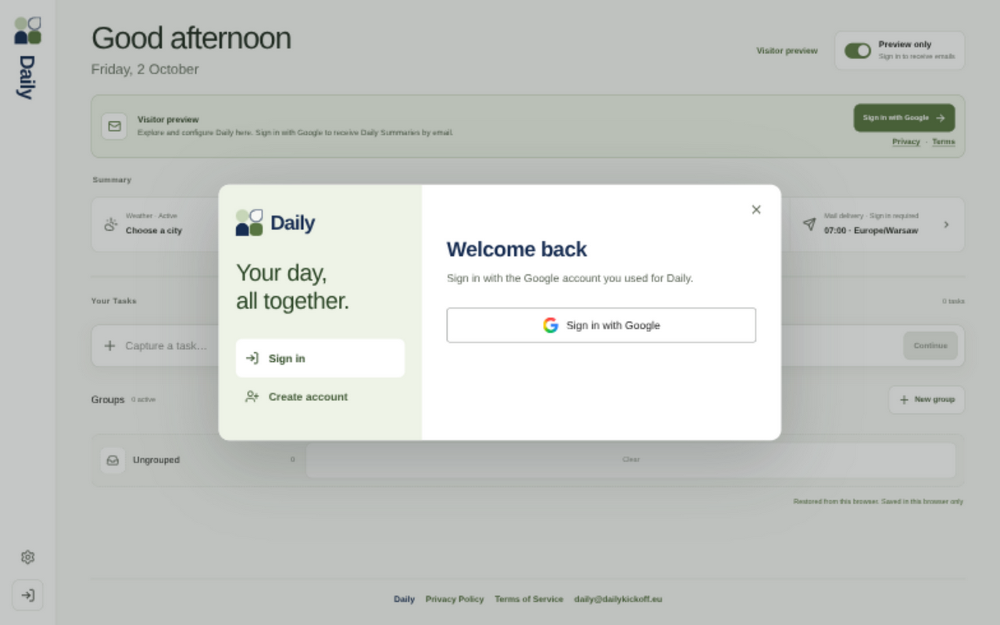
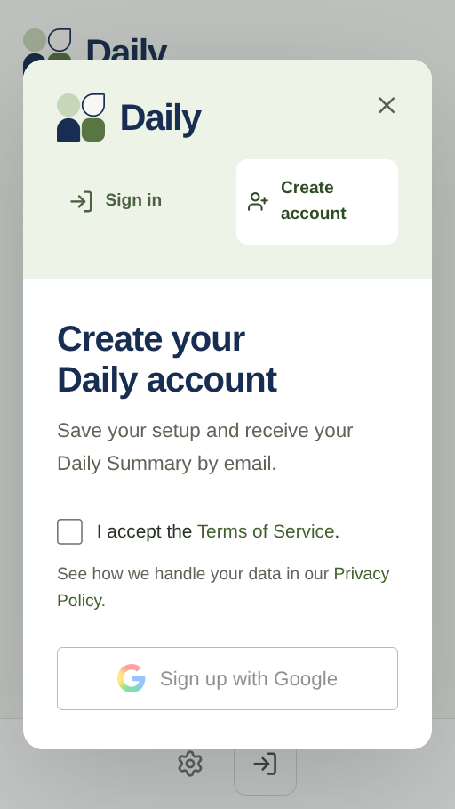

# Google authentication modal

## Approved design and behavior

Source: the user's approved prototype B on `prototype/auth-modal` (refinement commit
`d7af2ee`), followed by the explicit request to implement it and prepare a PR.
Review baseline: `e84d899` (the `main` commit including the new welcome screen).

- Open authentication in a popup over the existing Daily workspace.
- Offer Sign in and Create account in the same two-column modal (stacked on mobile).
- Use the current production Daily logo and wordmark via the shared DailyLogo component.
- Google is the only authentication method and the button names that method explicitly.
- Require Terms acceptance only when creating an account. Returning users do not see a consent gate.
- Remove the 16+ requirement and age self-declaration from authentication and public policy copy.
- Remove the prototype's six redundant labels: “Keep your setup.”, “Get your daily briefing.”,
  “I already use Daily”, “I’m new here”, “Google is currently the only sign-in method.”,
  and “Calendar access is optional. You can connect it later.”

## Implementation

The root page owns one AuthModal. Visitor actions in the rail, banner, Calendar and
Settings open it without navigating away. Native dialog behavior supplies the modal
backdrop, background inertness and Escape handling. Closing restores focus when the
original trigger remains available. Public query links also render a usable fallback
without JavaScript.

POST `/auth/google` receives an explicit `signin` or `signup` intent and checks the
request Origin. Signup checks Terms before starting Google, then signs a short-lived
Terms cookie. Better Auth disables implicit signup, so a new Google identity arriving
through Sign in returns to the registration modal. The user-creation hook still
rejects registration without a valid Terms cookie. Existing accounts can sign in
without that cookie. Google cancellation/errors reopen the relevant modal.

The account-creation callback inserts the Daily User and validated Terms acceptance
in the same SQLite statement before successful session creation. Request-scoped
acceptance is captured at the creation gate so cookie expiry later in the callback
cannot lose it. The workspace only clears the temporary cookie; no workspace load
is required to preserve acceptance. Visitor Local Setup import and Calendar's separate
permission flow retain their existing behavior. New consent records hold Terms time
and version; the old nullable age column is retained as historical data and receives
no new values. There is no destructive database migration.

Authentication callback/query links take priority over the automatic first-visit welcome
screen, so two modals cannot cover one another. Legacy confirmation routes redirect
to the new modal or workspace. Public Terms and
Privacy copy describe signup-only acceptance and no product minimum age. Existing
launch/legal-review documentation still records questions requiring separate review;
this change does not claim legal certification.

## Verification

HTTP integration exercises the real Better Auth OAuth callback, account/session
creation with a simulated Google provider, without rendering the workspace. It covers signup,
returning sign-in, implicit signup rejection, missing/tampered/expired consent and
cross-origin submissions. Regression coverage abandons the workspace redirect and
discards the Terms cookie before another sign-in; a separate test expires the cookie
between the creation gate and the account hook. Browser coverage checks intent switching, native form
submission, errors, dialog handoffs, keyboard behavior, task-draft preservation,
mobile layout and the no-JavaScript fallback. Live Google authorization is not
performed in the automated tests.

Google's unchanged G mark is from its official pre-approved sign-in asset bundle:
https://developers.google.com/identity/branding-guidelines

## Visual evidence

