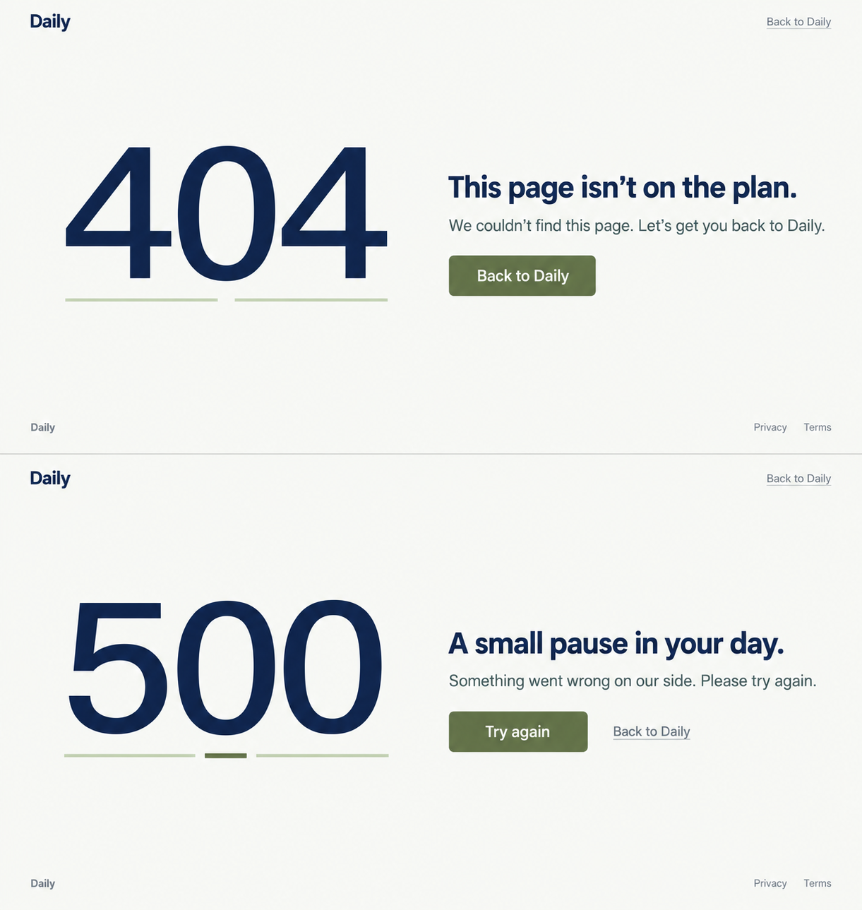
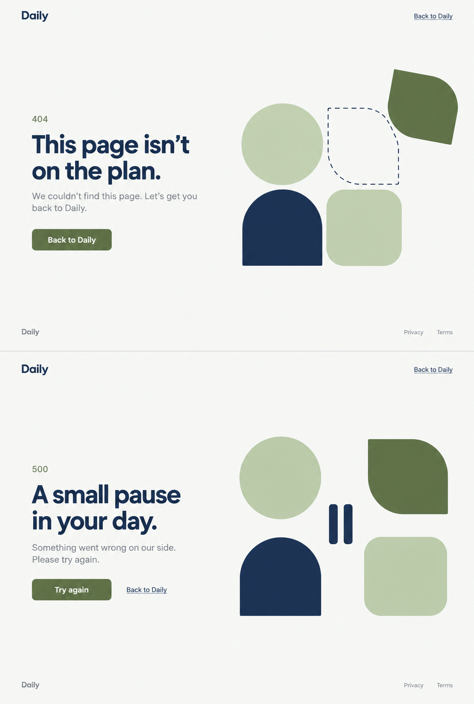
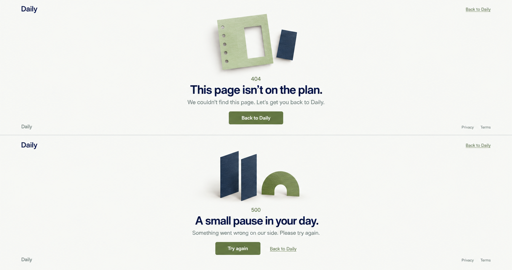

# Daily — propozycje stron 404/500

Trzy kierunki wizualne dopasowane do obecnego stylu Daily, przygotowane wbudowanym narzędziem `image_gen` (`imagegen`). Każda plansza pokazuje 404 u góry i 500 na dole. To makiety do wyboru, z angielskim tekstem zgodnym z interfejsem aplikacji.

| Wariant | Kierunek | Plansza | Wymiary PNG | Dokładny prompt |
| --- | --- | --- | --- | --- |
| A | Przerwa w planie — duże numery błędów, oszczędna typografia i przerwana linia | [01-przerwa-w-planie.png](error-pages/01-przerwa-w-planie.png) | 1221 × 1289 | [prompt A](error-pages/01-przerwa-w-planie.prompt.txt) |
| B | Geometria Daily — brakujący element dla 404 i znak pauzy dla 500 | [02-geometria-daily.png](error-pages/02-geometria-daily.png) | 1029 × 1528 | [prompt B](error-pages/02-geometria-daily.prompt.txt) |
| C | Papierowy poranek — centralny układ i subtelne papierowe ilustracje | [03-papierowy-poranek.png](error-pages/03-papierowy-poranek.png) | 1727 × 911 | [prompt C](error-pages/03-papierowy-poranek.prompt.txt) |

Użytkownik wybrał **02 — Geometria Daily**. Wybrany kierunek jest rozwijany jako interfejs aplikacji z semantycznym HTML, lokalnymi fontami Manrope i Fraunces oraz kolorami Daily. Pierwotne plansze pozostają zapisem propozycji. Cztery moduły znaku Daily tworzą ilustrację: w 404 zielony moduł wysuwa się z regularnego układu; w 500 dolny łuk zastępują dwa zaokrąglone słupki pauzy. Aktualna wersja opiera się na wybranej przez użytkownika bazie **189**, z przesuniętym modułem w 404 na wzór **109**. Górny prawy moduł w 404 i 500 ma jasnoniebieskie wypełnienie #EFF2F6 i granatowe obramowanie #172D52. Kod błędu i cała typografia pozostają natywnymi elementami interfejsu. [Aktualny podgląd 404/500](error-pages/189-selected.html) · [propozycje nagłówków](error-pages/189-selection.md).

Strona podglądu `/prototype/error-pages` została usunięta z aplikacji. Komponent obsługuje rzeczywistą trasę błędu SvelteKit, a archiwalne podglądy HTML pozostają w tym katalogu. [Przebieg niezależnych przeglądów](error-pages/review/iterations.md).

## Treść i działania

| Stan | Nagłówek | Opis | Główne działanie | Dodatkowe działanie |
| --- | --- | --- | --- | --- |
| 404 | A page out of place. | We couldn’t find this page. | Go to Daily | — |
| 500 | Daily, on pause. | Daily couldn’t load this page. Try again in a moment. | Try again | Back to Daily |

Nagłówek używa istniejącego komponentu `DailyLogo` i prowadzi do strony głównej; stopka zawiera Privacy i Terms. Powrót i ponowienie żądania działają także bez JavaScript. Błędy nie ujawniają szczegółów serwera, a rzeczywista strona zachowuje kod HTTP i otrzymuje `noindex, nofollow`.

Zachowano oryginalne PNG bez kadrowania i zmiany rozmiaru. Generator zastosował różne proporcje plansz mimo wspólnej prośby o dwa ułożone pionowo widoki desktopowe. Wszystkie trzy zawierają oba wymagane stany i ich działania. Każdy plik ma obok metadane `.png.json` z narzędziem, wymiarami, źródłem i promptem. Wariant 02 ma status wybrany przez użytkownika (`approved: true`); warianty 01 i 03 pozostają niewybrane. Kolejne studia rasterowe i zrzuty są materiałami procesu. Wybór pierwotnej propozycji nie oznacza akceptacji kolejnych iteracji.

## Studium rozwinięcia wybranego kierunku

[Nowa plansza imagegen](error-pages/02-geometria-daily-studio-study.png) przywraca szeroką kompozycję: komunikat po lewej, geometria po prawej. [Dokładny prompt](error-pages/02-geometria-daily-studio-study.prompt.txt) i metadane obok PNG zapisują źródło oraz oba obrazy referencyjne. To materiał procesu; działająca strona jest zbudowana w HTML/CSS/SVG.

## Podglądy

### A — Przerwa w planie

### B — Geometria Daily

### C — Papierowy poranek

